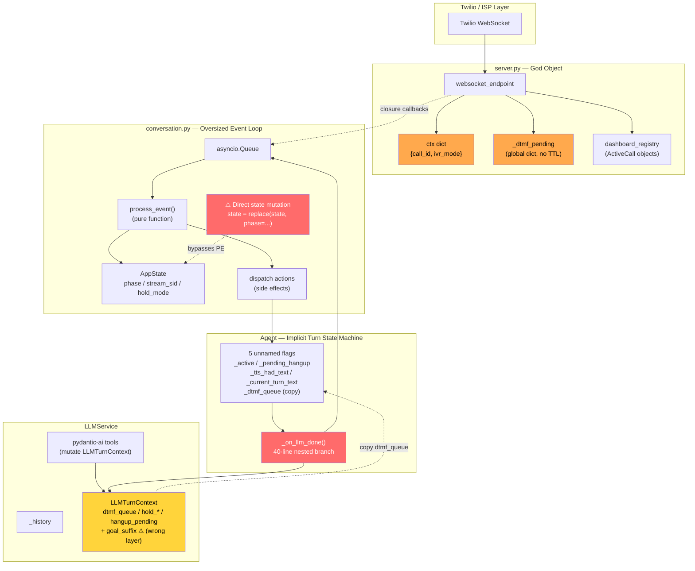
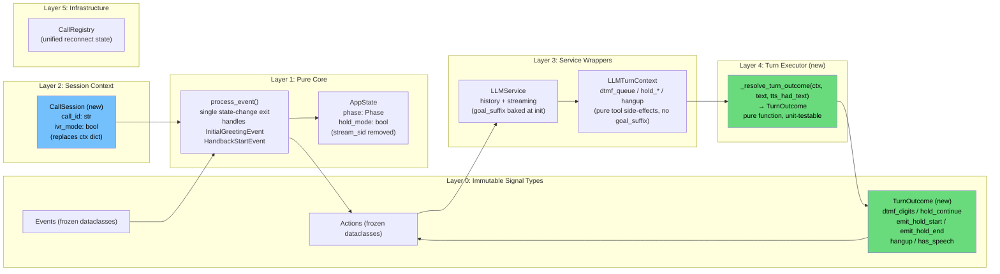
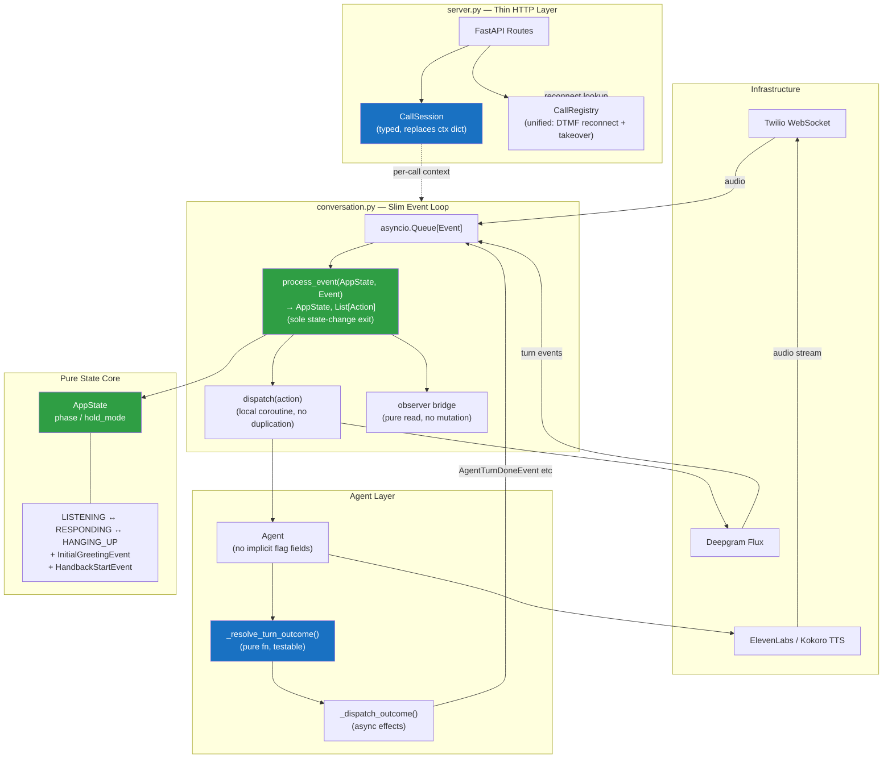

# Architecture Diagnosis: voice-agent State Management

> Generated: 2026-04-05  
> Scope: `shuo/` — state machine, agent pipeline, conversation loop, server

---

## 1. Executive Summary

The project has a clean functional core (`process_event` → pure) but as features grew, **four parallel state tracks emerged** that are aware of each other but have no clear ownership boundaries. The core tension: the system claims to be event-driven and pure, but several paths bypass the event system entirely.

---

## 2. State Subjects & Smell Catalogue

### `AppState` (`types.py` / `state.py`)
**Role:** Conversation phase routing (LISTENING / RESPONDING / HANGING_UP), hold mode.

| Smell | Detail |
|---|---|
| `stream_sid` identity pollution | `stream_sid` is connection metadata, set once, never read by any state-machine handler. Carried on every `process_event` call for no reason. |
| `hold_mode` mixed with `phase` | These are different abstraction levels: `phase` describes the turn lifecycle; `hold_mode` is a call-state modifier. They belong in separate structs. |

### `Agent` (`agent.py`)
**Role:** LLM → TTS → Player pipeline lifecycle; conversation history access.

| Smell | Detail |
|---|---|
| Implicit turn state machine | Five fields (`_active`, `_pending_hangup`, `_tts_had_text`, `_current_turn_text`, `_dtmf_queue`) collectively form an unnamed `TurnState` with no type boundary. |
| `_on_llm_done` god-branch | 40-line nested conditional (hold_continue → hold_start/end → hangup → dtmf → text → empty) — highest cognitive load in the codebase, untestable in isolation. |
| Duplicate DTMF state | `LLMTurnContext.dtmf_queue` → copied to `Agent._dtmf_queue` → used in `_on_tts_done`. Data copied twice across abstraction layers. |

### `LLMTurnContext` (`llm.py`)
**Role:** Per-turn side-effect collector for pydantic-ai tool calls.

| Smell | Detail |
|---|---|
| `goal_suffix` in per-turn object | Goal is a per-instance constant (set at `__init__`), not a per-turn side effect. Mixing it into a turn-scoped mutable object pollutes the type's purpose. |
| Mutable shared between layers | Tools (pydantic-ai internals) and `Agent._on_llm_done` both read/write this object across abstraction layers. |

### `run_conversation` closures (`conversation.py`)
**Role:** Main event loop, service lifecycle management.

| Smell | Detail |
|---|---|
| 2× direct state bypass | `state = replace(state, phase=Phase.RESPONDING)` called inline on StreamStart (greeting path, handback path), bypassing `process_event`. Breaks the "single state-change exit" invariant and causes incomplete transition logs. |
| `DTMFToneEvent` not routed through action system | Handled by special-case code (`# DTMF DISPATCH`) outside the main action dispatch, inconsistent with the rest of the architecture. |
| Service lifecycle mixed with business logic | 2,000-character function combines: Flux/TTS pool lifecycle, watchdog management, initial greeting, handback resumption, observer bridging, and event loop. |

### `server.py` global + per-call `ctx` dict
**Role:** HTTP routing, global pools, DTMF reconnect state, takeover reconnect state.

| Smell | Detail |
|---|---|
| Raw dict as shared closure state | `ctx = {"call_id": ..., "ivr_mode": False}` shared by 6 closures (`observer`, `should_suppress_agent`, `on_agent_ready`, `get_goal`, `on_dtmf`, `get_saved_state`). No type, no ownership. |
| `_dtmf_pending` parallel registry | Global `dict` implementing a cross-WebSocket state-transfer protocol (DTMF reconnect), separate from `dashboard_registry`, with no TTL or cleanup alignment. |
| Takeover reconnect embedded in factory | `get_saved_state`'s second branch directly manipulates `dashboard_registry`, destroys a bus, and reassigns `ctx["call_id"]` — a hidden registry mutation inside a conversation factory callback. |

---

## 3. Refactoring Priority

| Priority | Change | Benefit |
|---|---|---|
| **P0** | Extract `TurnOutcome` + `_resolve_turn_outcome()` pure fn | Eliminates `_on_llm_done` god-branch; enables unit tests |
| **P0** | Fix 2× state bypass in `conversation.py` via new events | Restores single-exit-point invariant; complete transition logs |
| **P1** | Remove `goal_suffix` from `LLMTurnContext` | Type purity; `LLMTurnContext` becomes a true per-turn container |
| **P1** | Replace `ctx` dict with `CallSession` dataclass | Type safety; eliminates raw-dict closure sharing |
| **P1** | Remove `stream_sid` from `AppState` | `AppState` models only routing logic |
| **P2** | Merge `_dtmf_pending` into `CallRegistry` | Single source of truth for call reconnect state |
| **P2** | Route `DTMFToneEvent` through action system | Architecture consistency |

---

## 4. Diagram 1 — Current State Model

---

## 5. Diagram 2 — Refactored State Model

---

## 6. Diagram 3 — Target Architecture (Global View)

---

## 7. Files Changed in This Refactor

| File | Changes |
|---|---|
| `shuo/shuo/types.py` | Add `TurnOutcome`; add `InitialGreetingEvent`, `HandbackStartEvent`; remove `stream_sid` from `AppState` |
| `shuo/shuo/state.py` | Handle `InitialGreetingEvent` + `HandbackStartEvent`; drop `stream_sid` from `StreamStartEvent` path |
| `shuo/shuo/services/llm.py` | Remove `goal_suffix` from `LLMTurnContext`; bake system prompt at init |
| `shuo/shuo/agent.py` | Extract `_resolve_turn_outcome()` pure fn + `_dispatch_outcome()`; slim `_on_llm_done` to 3 lines |
| `shuo/shuo/conversation.py` | Extract local `dispatch()` coroutine; replace 2× `state=replace()` bypasses with proper event routing |
| `shuo/shuo/server.py` | Add `CallSession` dataclass; replace `ctx` dict in `websocket_endpoint` |
