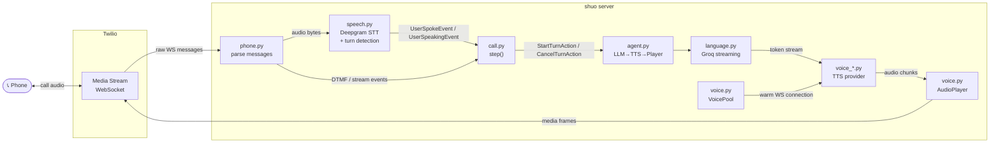

# shuo 说

A voice agent framework in ~600 lines of Python.

```bash
python main.py +1234567890
```

```
🚀 Server starting on port 3040
✓  Ready https://mature-spaniel-physically.ngrok-free.app
📞 Calling +1234567890...
✓  Call initiated SID: CA094f2e...
🔌 WebSocket connected
▶  Stream started SID: MZ8a3b1f...
← UserSpokeEvent "Hey, how's it going?"
◆ LISTENING → RESPONDING
→ StartTurnAction "Hey, how's it going?"
← AgentDoneEvent
◆ RESPONDING → LISTENING
```

## How it works

Two abstractions, one pure function:

- **Deepgram Flux** — always-on STT + turn detection over a single WebSocket (`speech.py`)
- **Agent** — self-contained LLM → TTS → Player pipeline, owns conversation history (`agent.py`)
- **`step(state, event) → (state, actions)`** — the entire state machine in ~30 lines (`call.py`)

Everything streams. LLM tokens feed TTS immediately, TTS audio feeds Twilio immediately. If you interrupt (barge-in), the agent cancels everything and clears the audio buffer instantly.

```
LISTENING ──UserSpokeEvent──→ RESPONDING ──AgentDoneEvent──→ LISTENING
    ↑                               │
    └────UserSpeakingEvent──────────┘  (barge-in)
```



## Package structure

```
shuo/                     # Python package (importable as `shuo`)
  call.py                 # Events, actions, CallState, step(), run_call()
  agent.py                # LLM → TTS → Player pipeline; owns history
  language.py             # LanguageModel (Groq + pydantic-ai tools)
  speech.py               # Transcriber + TranscriberPool (Deepgram Flux)
  voice.py                # VoicePool + AudioPlayer + dtmf_tone()
  voice_elevenlabs.py     # ElevenLabs WebSocket streaming TTS
  voice_kokoro.py         # Local Kokoro-82M TTS
  voice_fish.py           # Fish Audio S2 self-hosted TTS
  phone.py                # TwilioPhone + LocalPhone + dial_out()
  web.py                  # FastAPI server (HTTP routes + WebSocket handler)
  cli.py                  # Click CLI (serve, call, bench, local-call, …)
  bench.py                # IVR benchmark runner
  tracer.py               # Per-turn latency tracing
  log.py                  # Colored terminal logging
  ttft.py                 # TTFT benchmark endpoint
```

## Setup

Requires Python 3.9+, [ngrok](https://ngrok.com/), and API keys for Twilio, Deepgram, Groq, and ElevenLabs.

```bash
pipx install -e .
cp .env.example .env   # fill in your keys
python main.py +1234567890
```

## Tests

```bash
python -m pytest tests/ -v   # 133 tests, runs in ~0.03s
```

## License

MIT
