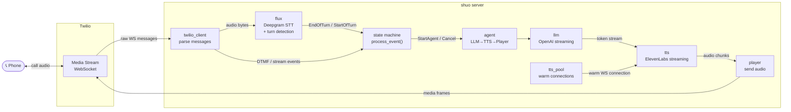

# shuo 说

A voice agent framework in ~600 lines of Python. 

```bash
python main.py +1234567890
```

```
🚀 Server starting on port 3040
✓  Ready https://mature-spaniel-physically.ngrok-free.app
📞 Calling +1234567890...
✓  Call initiated SID: CA094f2e...
🔌 WebSocket connected
▶  Stream started SID: MZ8a3b1f...
← Flux EndOfTurn "Hey, how's it going?"
◆ LISTENING → RESPONDING
→ Start Agent "Hey, how's it going?"
← Agent turn done
◆ RESPONDING → LISTENING
```

## How it works

Two abstractions, one pure function:

- **Deepgram Flux** — always-on STT + turn detection over a single WebSocket
- **Agent** — self-contained LLM → TTS → Player pipeline, owns conversation history
- **`process_event(state, event) → (state, actions)`** — the entire state machine in ~30 lines

Everything streams. LLM tokens feed TTS immediately, TTS audio feeds Twilio immediately. If you interrupt (barge-in), the agent cancels everything and clears the audio buffer instantly.

```
LISTENING ──EndOfTurn──→ RESPONDING ──Done──→ LISTENING
    ↑                        │
    └────StartOfTurn─────────┘  (barge-in)
```



## Project structure

```
shuo/
  types.py              # Immutable state, events, actions
  state.py              # Pure state machine (~30 lines)
  conversation.py       # Main event loop
  agent.py              # LLM → TTS → Player pipeline
  log.py                # Colored logging
  server.py             # FastAPI endpoints
  services/
    flux.py             # Deepgram Flux (STT + turns)
    llm.py              # OpenAI GPT-4o-mini streaming
    tts.py              # ElevenLabs WebSocket streaming
    tts_pool.py         # TTS connection pool (warm spares)
    player.py           # Audio playback to Twilio
    twilio_client.py    # Outbound calls + message parsing
```

## Setup

Requires Python 3.9+, [ngrok](https://ngrok.com/), and API keys for Twilio, Deepgram, OpenAI, and ElevenLabs.

```bash
pip install -r requirements.txt
cp .env.example .env   # fill in your keys
ngrok http 3040        # in another terminal
python main.py +1234567890
```

## Tests

```bash
python -m pytest tests/ -v   # runs in ~0.03s
```

## License

MIT
