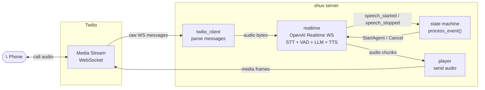

# Feature Proposal: Consolidate to OpenAI Realtime API

## Problem

The current architecture uses **four external API providers** to deliver a single voice conversation:

| Service | Role | API keys required |
|---|---|---|
| Twilio | Phone call + WebSocket transport | `TWILIO_*` (3 vars) |
| Deepgram Flux | STT + turn detection | `DEEPGRAM_API_KEY` |
| Groq | LLM | `GROQ_API_KEY` |
| ElevenLabs | TTS | `ELEVENLABS_API_KEY` + `ELEVENLABS_VOICE_ID` |

That's **6 API secrets**, 3 WebSocket connections per call, and a custom connection pool just to amortise TTS connection overhead.

---

## Proposal

Replace Deepgram + Groq + ElevenLabs with the **OpenAI Realtime API** — a single WebSocket that handles STT, VAD/turn detection, LLM, and TTS in one round-trip.

### Services after

| Service | Role | API keys required |
|---|---|---|
| Twilio | Phone call + WebSocket transport | `TWILIO_*` (3 vars) |
| OpenAI Realtime | STT + turn detection + LLM + TTS | `OPENAI_API_KEY` |

**2 services, 4 secrets, 1 AI WebSocket per call.**

---

## How OpenAI Realtime Works

`wss://api.openai.com/v1/realtime?model=gpt-4o-realtime-preview`

- Send raw audio (PCM16 or **G.711 μ-law** — exactly what Twilio sends).
- Receive server-side VAD events (`input_audio_buffer.speech_started`, `input_audio_buffer.speech_stopped`).
- Receive transcript + LLM response audio chunks in one stream.
- Audio output format: `g711_ulaw` — directly Twilio-compatible. Zero transcoding.

The model handles the full turn-taking loop internally.

---

## New Architecture

```
LISTENING ──speech_stopped──→ RESPONDING ──audio_done──→ LISTENING
    ↑                               │
    └────speech_started─────────────┘  (barge-in)
```



**Files removed entirely:**
- `services/flux.py` — Deepgram Flux replaced by Realtime VAD
- `services/llm.py` — Groq LLM replaced by Realtime model
- `services/tts.py` — ElevenLabs TTS replaced by Realtime audio output
- `services/tts_pool.py` — connection pool no longer needed (Realtime WS stays open)

**New file:**
- `services/realtime.py` — OpenAI Realtime WebSocket: send audio in, receive events + audio out

**Simplified `agent.py`:** no longer orchestrates LLM→TTS→Player chain; just forwards audio from Realtime to Player and handles cancel.

---

## State Machine Changes

The event/action vocabulary stays almost identical:

| Old event | New event | Source |
|---|---|---|
| `FluxStartOfTurnEvent` | `RealtimeSpeechStartedEvent` | OpenAI Realtime |
| `FluxEndOfTurnEvent` | `RealtimeSpeechStoppedEvent` | OpenAI Realtime |
| `AgentTurnDoneEvent` | `AgentTurnDoneEvent` | Player (unchanged) |
| `MediaEvent` | `MediaEvent` | Twilio (unchanged) |
| `StreamStartEvent` | `StreamStartEvent` | Twilio (unchanged) |

The pure `process_event()` function changes only in event type names. All transition logic stays the same.

---

## Barge-In

OpenAI Realtime has built-in barge-in support via `response.cancel` — send that message and the server stops generating immediately. No need to coordinate LLM cancellation + TTS WebSocket close + Player stop separately. The cancel path collapses from ~4 steps to 1.

---

## Environment Variables

**Before (6 secrets + 2 optional):**
```
TWILIO_ACCOUNT_SID, TWILIO_AUTH_TOKEN, TWILIO_PHONE_NUMBER, TWILIO_PUBLIC_URL
DEEPGRAM_API_KEY
GROQ_API_KEY, LLM_MODEL (optional)
ELEVENLABS_API_KEY, ELEVENLABS_VOICE_ID (optional)
```

**After (5 secrets + 1 optional):**
```
TWILIO_ACCOUNT_SID, TWILIO_AUTH_TOKEN, TWILIO_PHONE_NUMBER, TWILIO_PUBLIC_URL
OPENAI_API_KEY, OPENAI_REALTIME_VOICE (optional, default: alloy)
```

---

## Tradeoffs

| Factor | Current | Proposed |
|---|---|---|
| External services | 4 | 2 |
| AI providers | 3 (Deepgram, Groq, ElevenLabs) | 1 (OpenAI) |
| WebSockets per call | 3 (Twilio, Deepgram, ElevenLabs) | 2 (Twilio, OpenAI) |
| Connection pool | Required | Not needed |
| Voice options | ElevenLabs library (1000s of voices) | OpenAI built-in voices (alloy, echo, fable, onyx, nova, shimmer) |
| LLM choice | Any (Groq, OpenAI, etc.) | GPT-4o only |
| STT control | Deepgram config | OpenAI internal (less configurable) |
| Cost model | Per-service billing | Single provider billing |
| Vendor lock-in | Spread across 3 AI vendors | Concentrated on OpenAI |
| Code complexity | ~600 lines across 8 files | ~400 lines across 5 files |

---

## Latency Impact

The Realtime API runs LLM + TTS in the same inference pass — no serial HTTP hops between Groq and ElevenLabs. Expected latency is comparable to the current pipeline (~300–500 ms end-to-end from speech end to first audio byte) because:

- The TTS connection pool trick (pre-warming) becomes unnecessary — Realtime keeps one persistent WS alive.
- Token streaming from LLM to TTS is internal to OpenAI (zero network overhead between stages).
- OpenAI Realtime natively accepts μ-law 8 kHz and outputs μ-law 8 kHz — same zero-transcoding property as today.

---

## Implementation Plan

1. **`services/realtime.py`** — OpenAI Realtime WebSocket wrapper
   - `connect(session_config)` — open WS, send `session.update` with `input_audio_format: g711_ulaw`, `output_audio_format: g711_ulaw`, system prompt, voice
   - `send_audio(bytes)` — append to `input_audio_buffer`
   - `cancel()` — send `response.cancel`
   - Callbacks: `on_speech_started`, `on_speech_stopped(transcript)`, `on_audio(base64)`, `on_done`

2. **`types.py`** — rename Flux events to Realtime events

3. **`agent.py`** — simplify to: start Realtime session, forward audio chunks to Player, cancel on interrupt

4. **`conversation.py`** — remove Flux setup/teardown, remove TTS pool setup/teardown

5. **`services/`** — delete `flux.py`, `llm.py`, `tts.py`, `tts_pool.py`

6. **`.env.example`** — remove Deepgram, Groq, ElevenLabs keys; add `OPENAI_REALTIME_VOICE`

7. **Tests** — update event type names in `test_update.py`; pure state machine logic unchanged

Total diff: roughly **−250 lines, +150 lines** net reduction of ~100 lines and 4 files.
